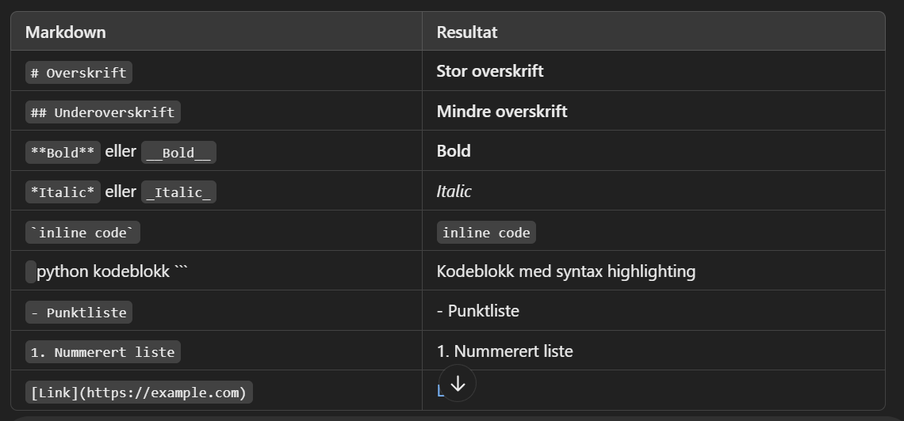

# 🌍 Miljødataanalyseapplikasjon

Dette prosjektet analyserer værdata fra datakilden Yr, ved hjelp av meteorologiske API-er. Programmet henter, prosesserer og analyserer værinformasjon for Ceciliekruna i Stryn ved hjelp av Python.

## Innhold

- [Oppgave 1: Sett opp utviklingsmiljø](#Oppgave1)
- [Oppgave 2: Datainnsamling](#Oppgave2)
- [Oppgave 3: Databehandling](#Oppgave3)

---

## 🛠️ Oppgave 1 Utviklings miljø 

Spørsmål for øvingstime:
- Hvordan fungerer er PEP 8?
- Hva er det som ønskes å oppnå ut ifra oppgave 2?
- Samme spørsmål for oppgave 3?
- Hvordan vil en vise at vi har tatt i bruk list comprehensions, iterators og pandassqlfd?
- 

[Test at utviklingsmiljøet fungerer](src/letsgo.ipynb)

## ✉️ Oppgave 2: Datainnsamling

## 🤖 Oppgave 3: Databehandling
